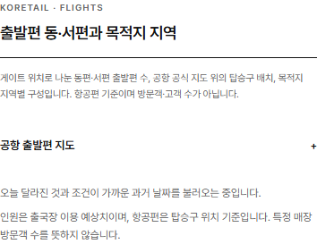
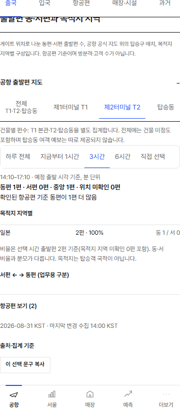

# 공항 본문 범위와 중복 요약 정리

사용자 요청(2026-10-06): 공항 본문의 서울·명동 인구/상권 블록을 제외하고, 위쪽에 이미 있는 동·서·중앙 하루 전체 요약을 아래에서 반복하지 않는다. 고유한 시간대·목적지·항공편 상세와 전역 서울 메뉴는 유지한다.

기준 main: `565c0341cfd2cea1ff9d2eaccdd68283f7179701`.

## 변경

- `retailpulse-app.tsx`: 공항 홈(`/ko`와 다른 언어 루트)의 `view === airport` 아래 `home-seoul-secondary` 조건부 본문 1곳을 제거했다. 공항 전용 경로·서울 메뉴·서울 4개 지역의 원래 데이터와 화면은 유지한다. 요청 `Sentinel_fddc74efab4881919071e2882f9fd26d`.
- `airport-departure-overview.tsx`: 중복 `FlightSplitCard` 호출 1곳을 제거하고, 하단 공항 출발편 지도는 기본 닫힘으로 바꿨다. 요청 `Sentinel_51e51fa42cfc8191979bd074b84816a0`.
- `airport-sides.tsx`: 닫혀도 상단 요약을 보내는 portal의 데이터/선택 상태를 유지한다. 일반 매장 화면의 지도는 종전처럼 열 때 로드한다. 펼침 가능함을 `+ / −`로 표시하며 실제 조작은 native details/summary가 담당한다. 원래 지도 계산·집계·목적지·항공편 목록·과거 비교는 보존했다.
- `tests/fixtures/phase2-locks.json`: 보호 대상 `app/retailpulse-app.tsx` 한 파일의 해시만 정상 갱신했다. `2ed6669aec005dc9bef2ab6d6f2aa8aa61400becffdb2bde0f4bf349912551c5` → `3ce5cf78fdd6db32a7dd35abbb39f9af0ebd94493318d691824abdf6cbdadc6a`. 해당 요청 근거를 추가하고 다른 보호 해시·목록·승인 기록·검사는 유지했다.

## 기존 차단 작업·다른 담당 범위와 구분

[PR278](https://github.com/rudvh1016-gif/retailpulse-korea/pull/278)의 원격 head `e567637`과 실제 diff를 비교했다. 그 PR의 `retailpulse-app.tsx` 변경은 `AirportView`의 상단 설명·TodayAnswer 출력 및 prop 제거다. 이번에는 그 내용을 그대로 유지하고 별개의 공항 홈 하단 서울 본문만 제거한다. `airport-departure-overview.tsx`와 `airport-sides.tsx`는 PR278 변경 파일에 포함되지 않는다. 차단된 변경을 복사하거나 재시도하지 않았다.

`live-signals.tsx`, 출국 대기·월누적 PC 배치, 예측 설명 접기(PR285), 공개 차트 검사 수정(PR287)은 이 PR에서 변경하지 않는다. 새 첨부를 다시 내려받으려 시도하지 않았다. 범위와 시각 확인은 실제 코드·로컬 앱에 근거한다.

PR284(출국 준비 안내)가 같은 `retailpulse-app.tsx`와 보호 해시를 수정 중이다. 먼저 병합된 변경을 다음 브랜치에 정상 통합한 뒤 결합된 파일의 해시를 다시 기록하고 해당 최종 SHA CI를 확인해야 한다. 각 요청의 승인 기록은 모두 보존한다.

## 검증과 한계

- 관련 E2E 123개: 최초 122 통과, 320px 정렬 검사 1개는 버튼별 비동기 좌표 측정이 스크롤 조정의 서로 다른 프레임을 읽어 실패했다. 같은 프레임의 DOM 측정으로 바꾸고 동일한 행 정렬 조건을 유지해 해당 1개가 통과했다. 다른 통과 검사는 반복하지 않았다.
- 새 공항 본문 검사: 한국어·영어·중국어·일본어의 루트/공항→서울→공항 이동을 확인했다. 320/390/430/1280px에서 기본 닫힘·상단 비율 유지·Enter/Space·터치·포커스·가로 넘침·3시간 선택·목적지 상세·항공편 보기·단 한 번의 항공편 조회를 검증했다. 최종 `+ / −` 표식 추가 후 해당 4개 화면 크기도 통과했다.
- 관련 단위 검사 77개 통과: `operational-phase2.test.mjs`·`font-coverage.test.mjs` 46개, `airport-flight-split.test.mjs`·`airport-departure-map.test.mjs` 31개. 활성 보호 해시·기존 계산·원본 집계 계약 포함.
- 변경 파일 lint·`tsc --noEmit`·빌드·서버 render 42개·전체 Git 이력 secret scan 통과. 최종 표시 수정 후 영향 lint·화면·빌드도 통과했다. 상세 최종 커밋/CI 상태는 PR 본문에 기록한다.
- 실제 로컬 앱 스크린샷을 열어 확인했다. 이미지는 테스트 fixture(하루 T2 3편, 이후 3시간 2편)를 사용한 검증 화면이며 공개 데이터의 관측 증거는 아니다.
- API·원본 데이터·집계식·수집기·스케줄러·의존성·런타임 비용을 변경하지 않았다. 별도 CLS 문제의 해결을 주장하지 않는다.

| 기본 닫힘 · 390px | 3시간 상세 열림 · 390px |
| --- | --- |
|  |  |
