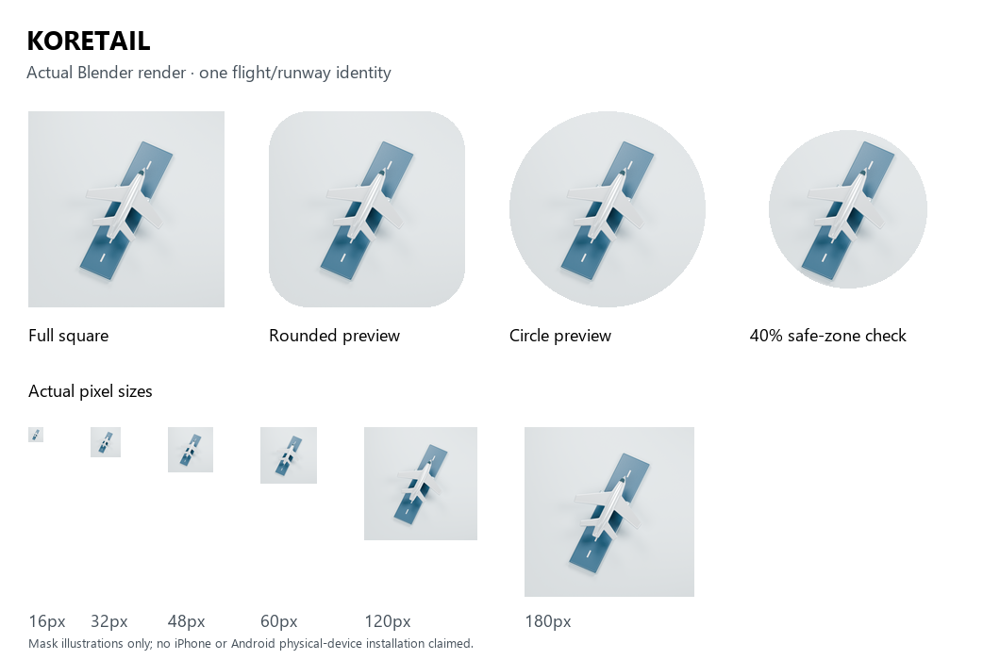

# KORETAIL 앱 아이콘 소스 자산 — 연결 차단 상태

실제 Blender 5.2.1 LTS / Cycles CPU로 만든 비행기·활주로 아이콘 자산을 보존하는 검토용 변경이다. 기존 원본 `icon_flight_v2/flight-B.blend`의 모형·재질을 재사용하고 카메라 여백·렌더 설정만 조정했다. 이전 후보의 앱 아이콘 최종 승인을 가정하지 않고 이번 구현 요청의 차분한 파스텔 방향으로 정리했다. 아이콘에 긴 글자를 굽지 않으며 KORETAIL 이름을 유지한다.

## 반영 상태

아이콘·앱 메타데이터·대응 UI Lock 갱신을 함께 처리하려던 명령은 자동 승인 검토에서 실행 전에 거절됐다. 이유는 보호된 fixture의 해시·항목·승인 기록과 추적된 앱/검사 파일을 영구 변경한다는 것이다. 재시도하거나 다른 실행 경로로 연결을 우회하지 않았다. 이 변경은 미사용 소스 자산과 문서만 추가한다. 기존 favicon·Apple Touch·manifest·app/layout.tsx·모든 보호 파일 53개는 바이트 동일하고 운영 아이콘은 아직 기존 파란 블록이다. 두 번 거절된 핵심 카드/UI Lock 변경과 통합 담당 소유 PR266 공유 이미지는 포함하지 않는다.

따라서 이 draft PR은 새 아이콘의 검토·재현용이며 실제 사이트/PWA 연결 완료를 뜻하지 않는다. 앱 아이콘 연결과 정상 보호 기록 갱신은 신뢰된 승인 경로에서 해결해야 한다. 사용자 직접 병합을 유지한다.

## 준비한 자산

`assets-src/app-icons-20261007` 아래에 최종 `.blend`, 확인 가능한 기존 원본 `.blend`, 실제 1024px 렌더, 축소·ICO·SVG·manifest 생성 스크립트와 출력 파일을 보존한다. favicon은 16·32·48px ICO와 같은 Blender 픽셀을 내장한 SVG, Apple Touch는 180px, 일반 manifest 아이콘은 192·512px, maskable은 512px로 준비했다. 모든 설치용 PNG는 전체 사각형·불투명 RGB다. OS 형태는 검토 이미지에서만 적용했다.

배경을 제외한 모형 정점의 투영 반경은 0.385다. [W3C Manifest 안전 영역](https://www.w3.org/TR/appmanifest/#icon-masks)의 중앙 0.4 반경 안에 주요 조형을 두었다. Apple 링크는 [공식 Web Clip 문서](https://developer.apple.com/library/archive/documentation/AppleApplications/Reference/SafariWebContent/ConfiguringWebApplications/ConfiguringWebApplications.html)를 참고했다. 예시 마스크를 각 OS의 정확한 실제 형태라고 주장하지 않는다.

준비된 연결안은 `-20261007` URL과 같은 바이트의 기존 이름 호환 파일을 사용하며 manifest `id=/`, `/ko` 시작 주소, `/` scope, KORETAIL 이름을 유지한다. 이 출력은 현재 public 경로와 메타데이터에 적용되지 않았다.

## 검증 범위와 설치 캐시

실제 Chrome에서 390·1280px 미리보기의 모든 이미지 디코딩, 가로 넘침 없음, 실행 오류 없음을 확인했다. 실제 Blender 실행·저장·렌더와 PNG 크기/불투명 배경·ICO 프레임·SVG 내장 이미지·안전 영역을 검증했다. 원본 앱과 보호 기준은 바뀌지 않았으므로 기존 전체 검사 반복을 하지 않는다. 필수 저장소 CI 상태는 PR에서 확인한다.

2026-10-07 05:51 UTC 공개 사이트에서 기존 아이콘의 1주일 캐시와 manifest의 1일 캐시를 확인했다. 새 URL은 새 파일 요청을 분리하기 위한 준비안이다. 기존 iPhone 설치 아이콘의 자동 갱신, iPhone/Android 실기기 설치와 OS 색조 모드는 검증하지 않았다. 서버의 새 연결 검증도 차단 때문에 수행하지 않았다.

재현은 소스 폴더에서 `blender --background --python rerender-icon.py`, Pillow가 있는 Python에서 `python export-icons.py`로 한다. 이는 소스 폴더 안의 렌더·자산을 생성하며 앱의 public 파일이나 보호 기준을 수정하지 않는다. 출처·해시·카메라는 `checks/blender-provenance.json`, 마스킹과 크기는 `checks/export-contract.json`, 차단은 `checks/connection-blocked.json`에 기록한다.
