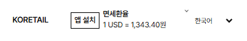
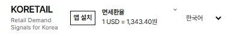

# 모바일 환율 한 줄 배치 — 기준 승인 대기

자동 환율 PR315의 source `8c78507222f0b2b9710644678a985102b0252cc1` 위의 별도 후속 브랜치다.
PR315의 source/CI를 변경하지 않는다. 제품 배포, 병합, 기준 hash 변경은 수행하지 않았다.

사용자가 “1usd = 의 =가 너무 짧아서 뭔가 잘린듯해.. 가로에 한눈에 들어오게못할까?
앱처럼설치 버튼크기는 줄여도돼 더작게 그리고 공간을확보해”라고 요청했다.
부모 스레드가 전달한 제약은 터치 영역/접근성 유지, 전체 폰트 변경 금지, 보호 기준 우회 금지다.

변경은 숫자의 `display:block` 줄바꿈을 없애고 환율 공간을 146px basis/124px 최소로 확보한다.
등호는 별도 inline 요소로 자연 글꼴과 크기를 그대로 쓰며 축소 transform/overflow clipping을 쓰지 않는다.
한국어는 `1 USD = [API 값]원`, 나머지 언어는 기존 KRW 단위다. 환율은 하드코딩하지 않았다.

모바일 설치 버튼의 표시 문구만 “앱 설치”/“Install”/“安装”/“追加”로 줄인다.
전체 원래 문구는 aria-label과 desktop 표시로 유지한다. 외곽 터치 영역은 최소 44×44px,
작은 안쪽 표시 테두리는 24px 높이다. 원래 설치/포커스/모달/키보드 동작은 유지한다.
전역 폰트 정의와 다른 화면의 글자 크기/레이아웃은 바꾸지 않았다.

## 검증된 실제 로컬 렌더

아래는 로컬 API fixture의 실제 Chromium 캡처다. 생산 자동 수집 성공을 뜻하지 않는다.

ko/en/zh/ja × 360/390/430/1280px와 기존 자정·재조회·네트워크/저장소 실패 등
환율 화면 26개 검사가 모두 통과했다. 등호 min-width/transform 없음, 실제 Range rect의 한 줄,
언어 선택과 겹침 없음, 터치 크기, glyph/overflow, 키보드/설치를 검증한다.
typecheck, 변경 TSX lint, production build 통과. 새 기준을 적용한 전체 CI는 아직 없다.

첨부 `libfile_4e4bd9a903448191a40a3626b37fbc88`은 공식 Library materialize에서
HTTP 403으로 파일을 받지 못했다. Library image read도 픽셀 대신 포인터/설명만 반환했다.
첨부의 픽셀을 봤다고 주장하지 않는다. 위 새 캡처의 실제 픽셀은 직접 검토했다.

## 멈추는 지점

원본 `tests/operational-phase2.test.mjs:123`는 보호 파일 각각의 SHA-256 일치를 요구한다.
원본 테스트를 실행하면 현재 `app/globals.css` 변경 때문에 FAIL이며 다른 59개 보호 파일은 그대로다.
`tests/fixtures/phase2-locks.json` 및 기존 검사/skip/retry/cron은 수정하지 않았다.
이 두 파일의 정상 보호 기준 갱신을 승인받기 전에는 후속 PR의 완료/병합 가능 상태라고 보고하지 않는다.

|보호 파일|기존 기준|현재 검토안|
|---|---|---|
|app/globals.css|cf09c40da3cc7eba578c6c627ac9630ec38fe26447d90f28ee567e887f5d36a4|42c61ee811f638e410c3088d96cdd1efbfb928b4e2a6473e10ec1510b0197d04|
|app/install-app.tsx|68df45129e118a68e1cfaa04dae8628da063dd6c8ca360a5b4576d3256696365|36a7e0aa0266c9e47583fb6c9466210c01b5221a002674d015266e3fde945b22|

승인 후의 정상 절차는 이 두 값만 승인 기록과 함께 갱신하고 원본 보호 검사,
관련 빌드/화면 및 exact-head CI를 확인하는 것이다. 원래 보호 목록과 다른 값/기록은 보존한다.
