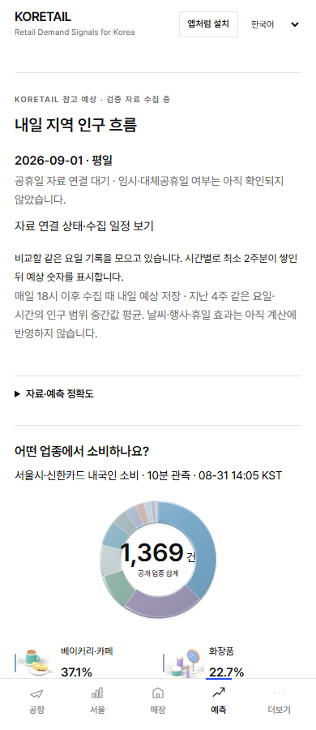
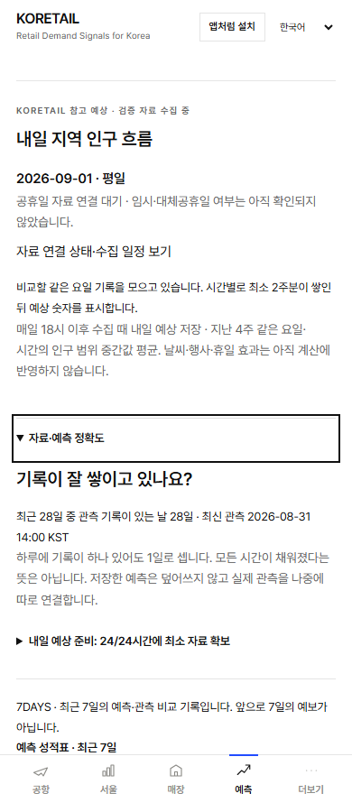

# 예측 자료·정확도 상세 접기

예측 탭에서 최근 28일 관측일수, 입력 준비 상태와 최근 7일 성적표가 기본 펼침으로 큰 공간을 차지했다. 이제 **자료·예측 정확도** 한 줄을 눌러 원래 내용을 볼 수 있다. 데이터·상세 조회·계산은 삭제하지 않았다. 공식 예상과 실제 관측의 구분, 참고 예상의 상태는 본 화면에 남는다.

- 기준 main: `565c0341cfd2cea1ff9d2eaccdd68283f7179701`.
- 사용자 요청: 2026-10-06 `Sentinel_d47b33b622548191b99a81eb91a92e40`; 예측 점검 설명을 숨기도록 위임한 새 범위다.
- 관련 조사: [Issue #283](https://github.com/rudvh1016-gif/retailpulse-korea/issues/283).
- `prediction-view.tsx`: 기존 영역을 native `details/summary`로 감쌌다. 기본 닫힘이며, 기존 `#prediction-score` 링크는 자료가 비동기로 도착한 후에도 열고 해당 성적표로 이동한다.
- 전용 CSS module: 검정 글자·기존 폰트·44px 이상 터치 영역·키보드 포커스·성적표의 헤더 아래 여백을 적용한다. 공통 CSS는 변경하지 않았다.
- 보호 기준: `tests/fixtures/phase2-locks.json`의 `app/prediction-view.tsx` 해시를 정상 갱신하고 요청 근거를 추가했다. 이전 `b9ccbfae7aac67f7aafd4e5ad2eb6739df50f166fa6723befa40db8742a08314` → `3b9c8ce57f0efb18fbc7e0b8e0e9b1e43baf5b0944ff2ef3bf078c57e1183042`. 다른 보호 해시·목록·검사·기존 승인 기록은 그대로다.

## 확인

- 변경 TSX/E2E 4개 파일 ESLint: 통과.
- `tsc --noEmit`: 통과.
- `node --experimental-sqlite --import tsx --test tests/operational-phase2.test.mjs tests/font-coverage.test.mjs tests/operational-predictions.test.ts`: 52개 통과. 활성 Owner UI Lock 검사 포함.
- `vinext build`: 통과. 기존 큰 chunk 경고는 남는다.
- `node --test tests/rendered-html.test.mjs`: 42개 통과.
- `node scripts/secret-scan.mjs`: 작업 트리와 도달 가능한 전체 Git 이력 검사 통과.
- `playwright test e2e/prediction-disclosure.spec.ts e2e/population-outlook.spec.ts e2e/operational-clarity.spec.ts --workers=2`: 15개 통과. 한국어 320/390/430px와 영어·중국어·일본어 390px, Enter/Space, 터치, 포커스, 가로 넘침, 비동기 자료 도착 후 직접 링크, 기존 서울 화면의 성적표 링크, 자료 없는 상태를 확인했다.
- 브라우저 스크린샷의 닫힘/열림 실제 픽셀을 확인했다. 아래 이미지는 실제 앱에 테스트 fixture를 연결한 검증 화면이며 공개 데이터 수치의 증거는 아니다.

| 기본 닫힘 · 390px | 열림 · 390px |
| --- | --- |
|  |  |

## 차트와 범위

예측 탭은 PR281의 공통 `PopulationFlow`를 이미 사용한다. 처음 조사한 공개 화면은 이전 slider UI였으나, PR281을 포함한 main `565c034`의 [배포 run](https://github.com/rudvh1016-gif/retailpulse-korea/actions/runs/37442311077)이 성공한 후 공개 `/ko/predictions?area=itaewon`을 다시 열어 실제 픽셀과 DOM을 확인했다(2026-10-06 09:28 UTC). 연결된 새 차트 1개, 전체/미래 전환 2개, 이전 range slider 0개였다. 관측·예측 경계선 모두 `rgb(100, 148, 179)`이고 관측은 실선, 예측은 점선이다. 선택 마커는 흰 바탕과 같은 파랑 테두리로 검정 점이 아니다. 따라서 차트를 재수정하지 않았다. 이 PR은 차트·API·예측 계산·수집기·스케줄러·원본 기록을 변경하지 않는다. 새 요청·D1 쓰기·의존성·유료 런타임은 추가하지 않았다. 운영 상태나 예측 정확도를 새로 보증하지 않는다.

공항 하단의 서울 본문 노출 요청은 별도 범위이며 이 변경에 섞지 않는다. 기존 차단된 PR278 변경도 포함하지 않는다. 새 첨부의 접근 문제는 재시도하지 않았다. 이번 화면 검증은 실제 코드와 로컬 앱에 근거한다.

최종 커밋·PR·필수 CI·병합/배포 상태는 연결된 PR 본문을 기준으로 확인한다. 로컬 통과 검사를 임의로 반복하지 않고 최종 SHA의 필수 CI를 따른다.
