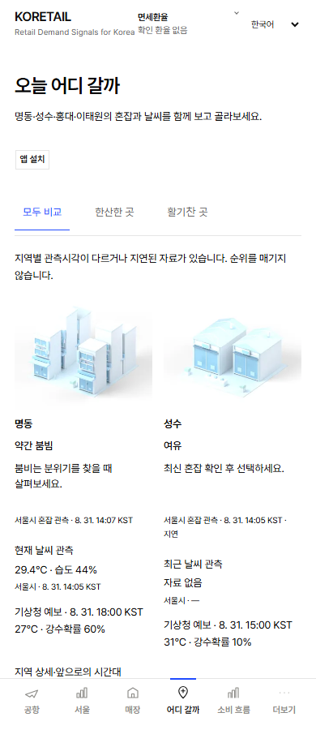
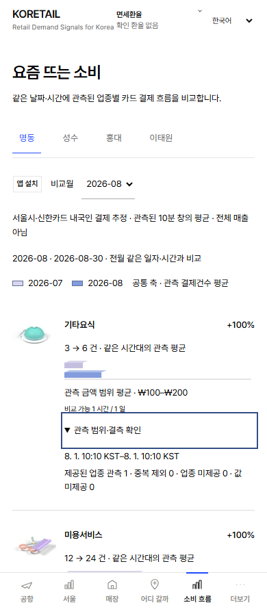

# 서울 비교 화면 구현 중간 기록 — 2026-10-08

공개 병합·배포·운영 DB 변경·수동 수집은 실행하지 않았다. 별도 worktree의 `feat/seoul-choice-consumption-20261008`에서 작업 중이다. 확인한 최신 main은 `22b7b0c28fdce1712b0c0fcbfa83023c4e1f64ce`이다. 기존 Claude 작업과 다른 worktree는 변경하지 않았다.

## 화면과 데이터 기준

- **오늘 어디 갈까**: 명동·성수·홍대·이태원 4개 지역의 공식 혼잡 단계, 실제 제공되는 관측 날씨·기상청 예보·각 기준시각을 한 번씩 표시한다. 동일 시각의 신선한 자료만 분위기 선택에 사용하며, 시각이 다르거나 지연됐을 때 순위를 만들지 않는다. 상권 매출을 개인 추천으로 바꾸지 않는다. 기존 서울 상세와 앞으로 시간대 선택은 유지한다.
- **요즘 뜨는 소비**: 지역·월 선택 후 실제 보유 업종을 모두 표시한다. 지역+상권시각+업종으로 중복을 제외하고, 완료된 같은 일자·시간의 10분 관측 평균을 비교한다. 누락·비공개는 0이 아니며, 이전 평균 0은 변화율 없음이다. 월 매출 총액을 만들지 않는다.
- 기존 별도 예측 메뉴를 교체하고 `/predictions`는 `/where-to`로 영구 이동한다. 예측·관측·계산 기록과 해당 저장·계산 코드는 삭제하지 않았다.
- 월별 요약은 신규 `seoul_commercial_months` 테이블에서 보존한다. 기존 일일 Actions 수집 흐름을 재사용하며 새 schedule/provider 호출은 없다. 지역별 하루 한 번만 현재·전월 원본을 인덱스로 제한 조회한다. 오래된 월은 비교 결과·관측 수를 보존하고 시간별 내부 배열만 축약한다. 운영 migration/집계는 아직 실행하지 않았다.
- 설치 버튼은 기존 상단 위치에서 제거하고 날짜 선택 왼쪽으로 이동한다. 작은 라벨과 44px 터치 영역·기존 실제 설치 안내를 유지한다.
- 공항 24시간 막대는 모바일 폭·간격만 조정하고 desktop 위치·폭 계산은 유지한다. 파랑·연보라와 선명한 범례를 사용한다. 날씨 관측과 예보의 고유 값·시각을 보존하고 겹친 제목만 간소화한다.

## 실제 DB 읽기 결과

기존 인증과 읽기 전용 진단 workflow를 사용했다. provider 요청·DB 쓰기·migration은 0이다. 계정 전체 사용량/무료 한도 안전을 보증하는 결과는 아니다.

- 첫 실행 [37774517788](https://github.com/rudvh1016-gif/retailpulse-korea/actions/runs/37774517788): `COMMERCIAL_AUDIT_READ_CEILING`. 집계 SQL의 실제 meta 읽기 176,116행 후 중단, 쓰기 0. 자료 없음의 증거가 아니다. 한도 100,000은 올리지 않았다.
- 수정 실행 [37775104238](https://github.com/rudvh1016-gif/retailpulse-korea/actions/runs/37775104238): 성공. 원본을 한 번만 인덱스로 읽고 JSON/중복/집계는 Actions에서 계산. 읽기 10,116행·쓰기 0·미측정 0.
- 업종 누락 분모를 추가한 [37778261340](https://github.com/rudvh1016-gif/retailpulse-korea/actions/runs/37778261340): 성공. 읽기 10,124행·쓰기 0·미측정 0. 안전한 coverage artifact에 업종별 시작·중복·결측·동기간 시간 수를 저장했다. 결제 금액/건수 원본 값은 artifact로 내보내지 않는다.

| 지역 | 보유 상권 자료 첫 시각 (KST) | 10월 보유 업종 | 업종 미제공/값 미제공 비율 범위 |
|---|---|---:|---:|
| 명동 | 2026-09-05 17:10 | 15 | 1.58%–99.37% |
| 성수 | 2026-09-05 17:20 | 14 | 2.83%–99.62% |
| 홍대 | 2026-09-05 17:20 | 14 | 0.29%–83.36% |
| 이태원 | 2026-09-28 08:20 | 14 | 18.02%–99.85% |

위 비율의 분모는 해당 월에 저장된 고유 상권시각이다. 업종 행 자체가 없는 경우를 포함하며 영업시간의 정상 비공개·원천 미제공·수집 결측 원인은 구분할 수 없다. 존재하는 업종 행에서 payments=null은 이번 조회에서 0건이었지만, 이는 누락이 없다는 뜻이 아니다. 일부 업종은 거의 모든 시각에 빠져 있다. 10월 완료일 1–7일과 전월 동일 일자·시간의 교집합을 사용하며, 이태원은 전월 동기간 겹침이 없다. 고정 11개 제한은 실제 데이터와 맞지 않으므로 사용하지 않는다.

## Blender·용량

실제 `district-refined-v2.blend`를 Blender 5.2에서 재사용해 4개 지역을 렌더했다. 모형에는 숫자·글자·추천 점수를 구워 넣지 않았다. 실제 지도와도 구분한다. 웹 숫자와 레이블은 데이터에 따라 바뀐다. 소비 업종은 기존 실제 Blender 아이콘을 재사용하며 미등록 업종에는 공통 개념 아이콘을 사용한다.

- 재현 스크립트: `scripts/render-seoul-comparison.py`
- 실제 Blender 결과: native workspace의 `outputs/seoul-choice-consumption-20261008/blender/seoul-comparison.blend`
- 웹 자산: `public/visuals/seoul-comparison/`의 320·640px WebP 8개, 합계 44,674 bytes. 320px 4개 합계 13,042 bytes.
- 같은 Vite build의 전체 client 파일 gzip 합계: JS 465,263 → 468,864 bytes, CSS 55,716 → 56,586 bytes. 새 화면 추가 비용이다. 페이지 초기 다운로드/PSI/LCP 개선 수치로 해석하지 않는다. 새로운 3D 런타임 엔진·폰트·의존성은 추가하지 않았다.

## 실행한 검증과 남은 작업

- 새 월 집계/저장 단위 검증: 6개 통과. 중복, 결측, 0, 맞춘 시간만 비교, 월 매출 합산 금지, 하루 중복 갱신 차단, 과거 월/예측 보존, 읽기 실패 시 마지막 정상 값 보존을 확인했다.
- 새 화면 E2E: 18개 통과. 360/390/430/1280px, ko/en/zh/ja, 15개 업종 전체 목록, overflow·pageerror, 키보드/reduced-motion, 설치 안내와 포커스 복귀, 이전 URL, 요청 실패/재시도를 확인했다. **화면 숫자는 명시적인 테스트 fixture이며 실제 운영 월간 수치가 아니다.**
- lint·typecheck·Vite build·secret scan 통과. 기존 unrelated 통과 테스트/수집/배포는 수동 재실행하지 않았다.
- 원본 Owner UI Lock 테스트는 실패 상태로 유지했다. `tests/fixtures/phase2-locks.json`·원래 assertion·61개 membership·cron은 수정하지 않았다. 변경된 protected 파일은 정확히 4개: `app/[locale]/[slug]/page.tsx`, `app/live-signals.tsx`, `app/retailpulse-app.tsx`, `app/seo-config.ts`. 다른 57개 protected hash는 유지한다. 새로운 정상 기준선 승인 없이는 fixture를 갱신하지 않는다.
- 기존 예측 화면을 가정하는 일부 E2E의 새 화면/기록 보존 검증으로의 전환, 공항 막대의 전후 geometry 상세 확인, 빠른 지역·월 전환/실패·최신 시각 심화 검증이 남았다. 현재 초안은 병합 가능 판정이 아니다.
- PR316 자동 Production Visual Check [37769384795](https://github.com/rudvh1016-gif/retailpulse-korea/actions/runs/37769384795)는 43 pass/7 skip/8 fail. 8개는 기존 `.airport-glance-strip`를 기대하는 `redesign-readout.spec.ts` 4언어×모바일/desktop 검사다. 이번 새 기능과 섞어서 수정하거나 재실행하지 않았다.

자동 승인 검토가 실제 DB 결제 건수·금액을 담은 미리보기 artifact의 GitHub 업로드를 명시적 egress 승인 부족으로 거절했다. 그 업로드는 실행하지 않았다. 테스트 fixture와 coverage metadata로 독립 구현·검증을 계속했다. Native Library의 공식 파일 경로 업로드도 이전에 차단돼 현재 새 Library ID는 없다. 임의 transfer 우회는 하지 않는다.

