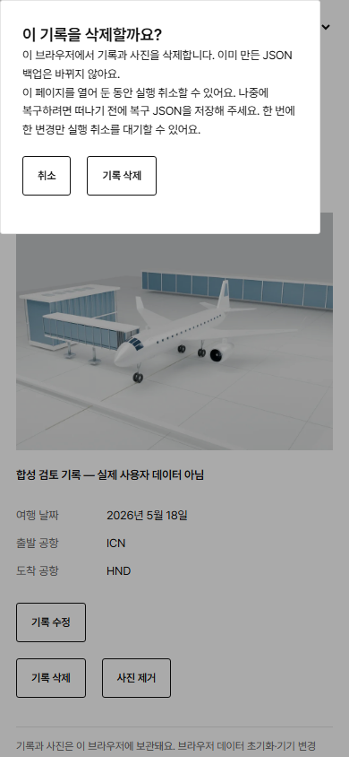
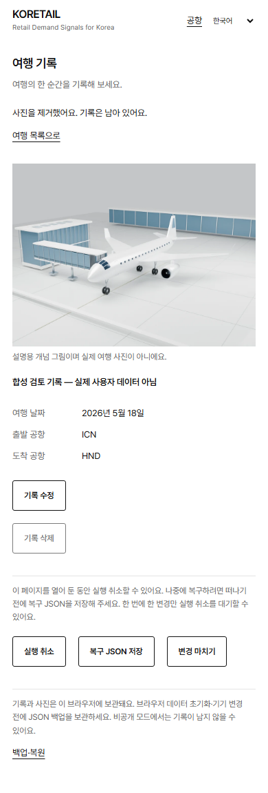

# 이번 변경의 검증 기록

2026-10-08 KST, Windows / Node v24.17.0 / repository-pinned tools. 시작 main 및 PR 생성 전 재확인 main: `bf9362466145c2f2e047b8c74daedac6fbd72e54`. 독립 clone `retailpulse-app-store`, branch `feat/app-store-travel-safety-20261008`. 합성 QA 데이터만 새 Playwright browser context에 저장했다. 실제 사용자 여행 데이터를 삭제하거나 production 데이터에 쓰지 않았다.

## 실행한 검사

| 검사 | 결과·범위 |
| --- | --- |
| 변경 파일 ESLint | exit 0. 여행 wrapper/view/actions/media/copy, model/storage/types, 새 E2E 및 native config/main |
| `tsc --noEmit` | exit 0. 변경으로 추가한 revision number/string 호환을 포함 |
| 여행 기록 unit | 9/9 통과. 최종 model 변경 후 해당 suite만 재실행 |
| 새 삭제 E2E — 웹 SSR route | 최종 10/10 통과, 7.9초. ko/en/zh/ja 확인·취소·Escape·undo, 사진 제거+동일 ID 이전 백업 건너뜀, 삭제본 recovery JSON 미리보기/취소/확인, stale delete/undo, delete 실패/undo quota 실패, 복원 후 오래된 편집창 거부와 새 수정 |
| 새 삭제 E2E — 정적 client build | 처음 9/9 케이스 성공. Windows preview server 종료 대기로 runner teardown 지연; 해당 검사용 server를 끝낸 후 exit 0 / `9 passed (12.9m)`. 마지막 revision 변경 뒤 새 복원 회귀 1/1을 기존 수동 preview에서 실행, exit 0 / 2.0초. 통과한 9개를 상태 보고용으로 다시 실행하지 않음 |
| 기존 travel E2E 일부 | 3/3 통과: add/edit/reload/locale, 사진 로컬 표시·손상/HEIC 교체 거부·외부 요청 없음, JSON 미리보기 취소·중복·변조 거부. 이 3개는 view 추출 후 해당 저장/백업 영향만 확인한 범위 |
| 독립 Vite client build | exit 0, 27 modules. 최종 JS 241.47 kB (gzip 77.91), CSS 203.30 kB (gzip 42.33), HTML 0.74 kB. Next/vinext/Worker/GA4/beta endpoint runtime 문자열이 없음. CSS의 97개 fonts 경로 파일과 OFL license 동봉 확인. SSR output은 사용하지 않음 |
| 기존 Owner UI Lock | 원본 검사 1/1 통과, 61개 보호 파일·기존 schedule 그대로. Windows clone의 autocrlf 때문에 첫 byte hash 검사 실패. 원본 Git blobs의 해시가 fixture와 일치하는지 먼저 확인한 뒤 checkout 바이트만 원본으로 맞춰 동일 검사를 통과. fixture/검사 코드는 수정하지 않음 |
| 비밀 정보 검사 | 여행/app-store/native 변경 범위의 기존 고신뢰 credential 패턴 검사 통과. 기존 full reachable-history scan을 시작했다가 중단하고 범위 검사로 제한했음; 전체 이력을 다시 통과했다고 주장하지 않음. 이전 full 검증 기록을 재사용하고 PR의 필수 CI는 별도로 확인 |
| 시각 검토 | 아래 390px 합성 데이터 캡처 2장을 실제로 열어 확인. 삭제 dialog의 취소·확인, 사진 제거 후 개념 그림의 명시적 안내·실행 취소·복구 JSON·마치기 표시. 캡처 때 수평 overflow 없음. iPhone 실기기 캡처 아님 |

검사 명령은 POSIX npm wrapper를 수정하지 않고 실제 설치된 underlying CLI를 사용했다. Node tsx의 초기 sandbox 사용자 정보 조회 오류는 같은 원본 Owner UI Lock 검사를 정상 실행 가능한 환경에서 다시 실행해 해결했다. 이는 검사나 보호 제한을 끈 것이 아니다.

## 캡처

사용권 있는 기존 개념 그림을 합성 사진 fixture로 사용했으며 실제 여행 사진이나 실제 사용자 메모가 아니다. 이 이미지는 개발 검토용이고 App Store 제출용 device screenshot이 아니다.

## 재사용한 기존 증거

- `docs/TRAVEL_RECORDS_REVIEW_2026-10-06.md`: 이전 full lint/typecheck, 1,160 unit, vinext build, 42 rendered HTML, 27 travel E2E, 16 departure E2E와 privacy/photo 동작. 이번에는 전체 웹 검사를 반복하지 않았고 이전 성공을 이번 SHA의 신규 전체 PASS로 바꾸지 않았다.
- `docs/APP_ICON_ASSETS_2026-10-07.md`, `assets-src/app-icons-20261007/checks`: 기존 1024px icon·Blender·export/asset 검증. 아이콘 재제작·보호 기준 변경 없음.
- Root `AGENTS.md`, `CLAUDE.md`, Shared Project State, Engineering Direction, Zero-Cost Hybrid Audit, brand/security 및 관련 문서를 읽었다. 이 clone에는 `.agents/skills`가 없어 vendored `.claude/skills/web-design-guidelines`와 React best-practices 체크를 적용했다. 새 button/dialog은 semantic controls, 취소 초기 focus·Escape·aria alert/live region, 기존 touch/overflow/type token을 유지한다.

## 적용되는 운영 감사와 남은 차단

Server collection/Cloudflare/D1/scheduler/cost architecture는 바뀌지 않았다. 새 store operation은 기기 IndexedDB뿐이다. 새 공급자 호출·D1 write·Cron·runtime LLM·유료 서비스가 없으므로 공급자 quota/traffic benchmark를 새로 수행하거나 안전 용량을 주장하지 않았다. 기존 70/85/95 보호, source truth와 immutable forecast/outcome 규칙을 변경하지 않는다.

PR 필수 CI는 생성 후 확인한 상태를 PR 본문에 기록한다. Draft는 병합/배포하지 않는다. main이 이후 바뀌면 통합 담당자가 해당 diff와 필수 CI를 검토한다.

남은 차단: Mac·Xcode/SDK·Apple membership/판매자 명의/국가 범위, 최종 앱 범위와 4.2 utility 증거, Capacitor/iOS project·native file/photo adapter·권한/privacy manifest·서명 archive, 실제 iPhone Safari/WKWebView·HEIC picker·지속성·offline cold launch, 운영자 승인 개인정보/지원 URL·보관기간과 최종 App Privacy 신고. Windows 검증은 이 항목들의 PASS가 아니다.
