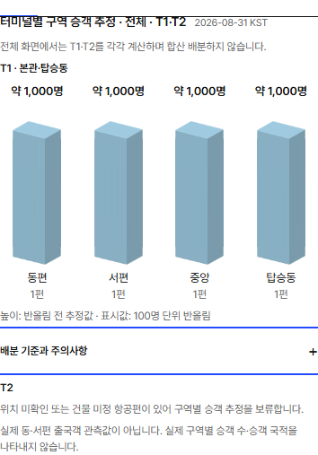
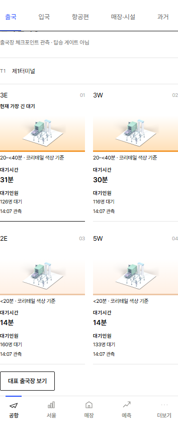

# 2026-10-09 KST airport recovery and current-day safeguards

## Observed incident and normal recovery

Before recovery (08:07 KST), the selected date and APIs were correctly Oct 9, but no Oct 9 A1/A2 collector run or airport_flights row existed. The active early/daily GitHub schedules had not started for that KST date. A dated official schedule fallback held 585 flights, only 42 with assigned gates; the collected flight scope was zero. This was a missed/delayed collection, not a reproduced frozen tab or wrong-date cache.

After checking concurrent runs and the current-day ledger, the operator requested the existing early workflow **once**, without changing schedules, credentials, caps or deployment code:

- Recovery [37858636048](https://github.com/rudvh1016-gif/retailpulse-korea/actions/runs/37858636048), main `f3ca0434a2a7b9c1aa87c330da3aacf864ddb7d0`.
- First A1 attempt: SUCCESS; 119 pages / **119 provider requests**, 590 unique departures for Oct 9, 953 changed rows / 3,314 A1 storage writes. A2 enrichment also succeeded.
- The separate holidays context returned HTTP 403, retaining its last-good data and making the overall workflow red. Its two existing generic retries skipped A1 as already complete (zero extra A1 requests), but repeated A2/context work. The holiday failure remains recorded; a red aggregate badge is not proof of A1 failure.
- Read-only evidence: [before 37858374562](https://github.com/rudvh1016-gif/retailpulse-korea/actions/runs/37858374562), [after 37860090862](https://github.com/rudvh1016-gif/retailpulse-korea/actions/runs/37860090862). After storage: Oct 9 **590 departures / 589 with gates**, retrieved 08:18:25 KST. No further collection was requested.
- Real public Chromium verification at 08:26 KST: today 590, collected-flight basis, T1 main 168 / T2 277 / concourse 145, one T2 gate unknown. Console errors zero. Flight-tab click 48 ms before / 42 ms after; data differs, so this is an interaction observation, not a controlled speed gain or Lighthouse/PSI result. LCP/CLS were not measured in this recovery check.

| Building | West | Central | East | Unknown | Its denominator |
| --- | ---: | ---: | ---: | ---: | ---: |
| T1 main | 88 (52.4%) | 12 (7.1%) | 68 (40.5%) | 0 | 168 |
| T2 | 128 (46.2%) | 19 (6.9%) | 129 (46.6%) | 1 (0.4%) | 277 |
| Concourse | 60 (41.4%) | 32 (22.1%) | 53 (36.6%) | 0 | 145 |

Unknown flights remain in their building's denominator. Flight counts are not people or queue measurements. Rounded percentages can differ from 100%.

## Minimal reviewable changes

1. The existing three-attempt A1 early ladder consumes **its own A1 result**, reusing the established collector-log parser and transient-failure predicate. Only a classified FETCH-stage network/timeout/5xx failure permits its next existing job. Success, complete-day skip, holiday/A2-only failure, permanent/auth/schema/empty/throttled/unknown results and STORE errors do not repeat A1/A2. Original failures stay red. Caps remain 3 x 125 early + 125 daily = 500; no new attempt, cron or automatic provider recovery.
2. A separate read-only witness job reuses the existing realtime trigger and credentials. It performs three bounded SELECTs, including the existing complete-scan marker; after the internal 05:15 KST grace it flags missing current-day rows, incomplete scan proof or old/unverified collection stamps. No provider calls, writes or last-good-health changes. Read failure is reported as unavailable, never inferred as zero flights. This checks availability and scan proof, not all gates or external publication SLA.
3. The model shows its own service date, official schedule versus collected-flight basis, exact KST collection timestamp and today's collection-pending fallback status. Cross-midnight source dates stay distinct. Existing client date checks, same-window/building calculations, truncation withholding and pre-storage complete-page validation are reused.
4. The estimate heading names terminal/zone scope, with equal T1 and T2 sections and a PARTIAL state when only one terminal is displayable. T1 explicitly includes main building plus concourse; T1's passenger denominator uses 168 + 145 = 313 departures. T2's one unassigned gate still withholds its passenger estimate. No T1-to-all relabelling, invented T2 estimate or calculation-policy change.
5. Verified numeric T1 checkpoints (2-5 E/W) use the same <20 / 20-<40 / 40-<60 / 60+ minute bands as T2, explicitly labelled **KORETAIL color criteria**, not official T1 grades. Waiting head counts never set color. Freshness, closed/missing/future/unknown guards and reduced-motion behavior remain.

## Validation and limits

- Unit: 1,254 passed; UI Lock unchanged and passed. New current-day/failure tests 8 passed after the read-protocol correction; T1 minute-color tests included.
- Lint, TypeScript and Worker build passed; rendered HTML 46 passed. Existing bundle-size/dynamic-import warnings remain.
- Relevant E2E: 44 existing cases passed; 21 new cases passed (65 distinct cases) after correcting two test selectors and matching the native preview origin. 360/390/430/1280, four languages, separate denominators, T2 withheld state, old schedule timestamp, zero counts, keyboard disclosure, reduced-motion and console/overflow checks.
- Native Windows used the complete Worker/Vinext dev configuration with an isolated cache below a node_modules path; an initial external cache caused duplicate RSC exports. A separate preview-origin mismatch caused real CSP console errors and was fixed by aligning the preview port, without changing CSP or suppressing errors. These are local verification settings, not committed production changes.
- Actual current-day recovery is already public. Safeguard/UI code in this branch is draft-only and not deployed. GitHub/provider timing can still fail; monitoring is not a guarantee or a second collector.

## Remaining work kept separate

- Long explanatory copy in protected `app/live-signals.tsx` was not edited. Required observation/collection timestamps, forecast/schedule distinctions, transfer-date basis and deduplication/concourse rules remain. Existing protected-baseline rejection scopes (PR317/319) were not retried or bypassed.
- The requested Seoul movement/foreign-flow Blender scene is a separate pending asset task; no airport scene was replaced. Its daily/reference dates and unverified tourism-mobility unit must remain textual.
- FX retry refinements and METAR work remain paused behind the airport priority.
- Merge/deploy requires the separately pending approval. No merge, manual deploy, new secret, paid service or protection bypass was performed.

Screenshots below use regression fixtures (Aug 31), not today's production numbers. The actual public recovery screenshots and operational JSON/logs are preserved in the local evidence directory.

