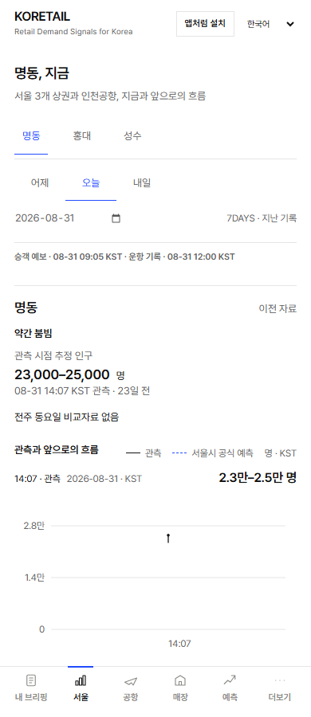
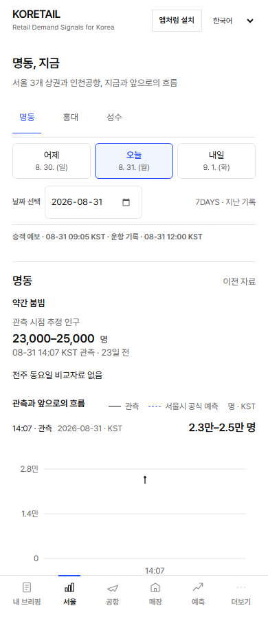
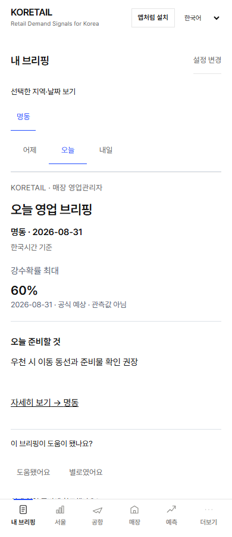
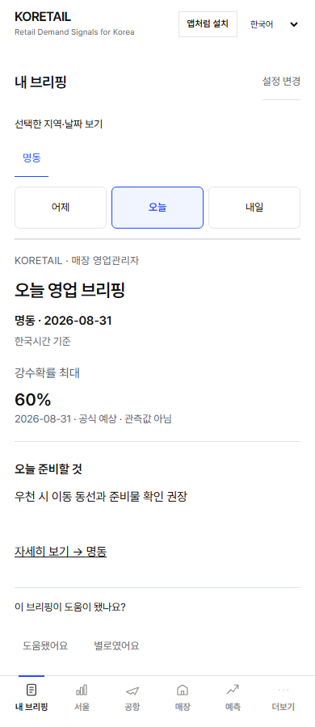

# 날짜 컨트롤 전후 비교

2026-09-23, Chromium 390×900, 동일한 로컬 e2e fixture(2026-08-31 기준). 실제 오늘 운영값을 촬영한 것이 아니다. 375/390/430/1280px 네 크기와 네 언어는 `e2e/date-controls.spec.ts`로 별도 검증한다.

| 화면 | 변경 전 | 변경 후 |
|---|---|---|
| 공개 지역 화면 |  |  |
| 개인 브리핑 |  |  |

기존 밑줄 선택에서 얇은 버튼 테두리·옅은 파란 선택 배경·52px 터치 영역으로 변경. 공개 화면의 날짜와 요일은 기존 서버 날짜만 형식화한다. 개인 브리핑은 기존 글자와 선택 로직을 유지한다. 네비게이션·수집·API·캐시·D1 변경 없음.

기준: #206 위에 정리한 #205(b7fca37)를 변경 전으로 사용하고, 그 위에 날짜 표현만 적용한 #211을 변경 후로 촬영했다. 기존 공항 날짜 처리·공개 핵심정보·가이드는 양쪽에서 동일하다.
